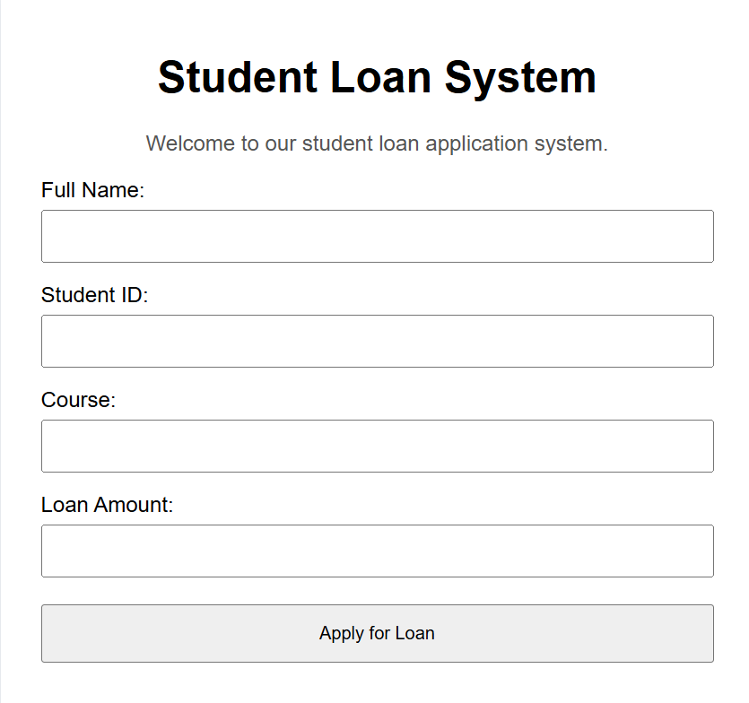
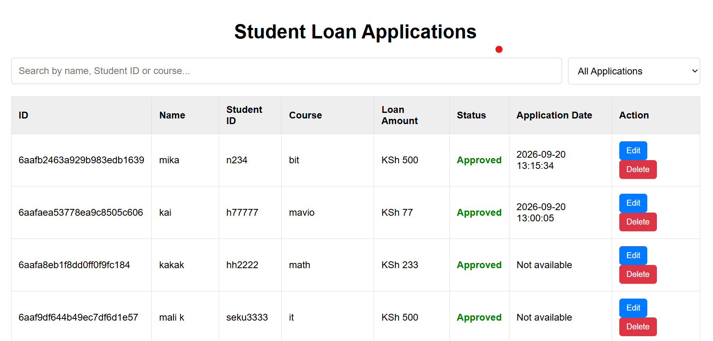
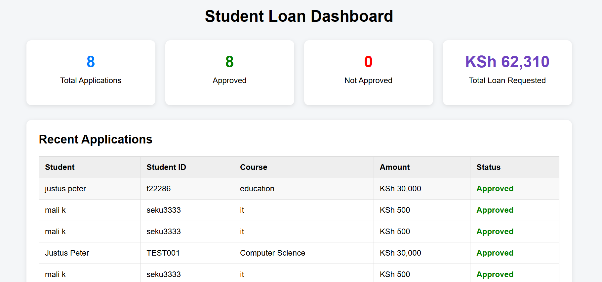

# Student Loan System

A full-stack student loan application system developed to simplify the process of submitting, managing, and reviewing student loan applications.

# 🎓 Student Loan System

A web-based student loan application and management system developed using **Python, Flask, HTML, CSS, JavaScript, and MongoDB**.

The system allows students to submit loan applications and provides administrators with a dashboard for viewing applications, monitoring loan requests, and managing application information.

## 🎯 Project Purpose

The purpose of this project is to provide a simple digital solution for managing student loan applications. It reduces manual processing and makes it easier to record, review, and monitor student loan requests.

## ✨ Key Features

- 📝 Student loan application form
- 📋 View submitted loan applications
- 📊 Dashboard with application statistics
- 💾 MongoDB database for storing applications
- ✅ Automatic loan approval decision
- ❌ Automatic rejection for applications exceeding the allowed limit
- 📱 Responsive and simple user interface
- 📸 Screenshots demonstrating the system

## 🛠️ Technologies Used

- **Python** – Backend programming
- **Flask** – Web application framework
- **HTML5** – Page structure
- **CSS3** – Styling and layout
- **JavaScript** – Client-side functionality
- **MongoDB** – Database management
- **Git & GitHub** – Version control and project hosting

## 🔄 System Flow

Student
↓
Loan Application Form
↓
Flask Backend
↓
Loan Processing
↓
MongoDB Database
↓
Application Result


## 📂 Project Structure

```text
student-loan-system/
│
├── app.py
├── loan.db
├── requirements.txt
├── README.md
│
├── static/
│   ├── script.js
│   └── style.css
│
├── templates/
│   ├── index.html
│   ├── applications.html
│   └── dashboard.html
│
└── screenshots/
    ├── home.png
    ├── applications.png
    └── dashboard.png
```

### 📄 File Description

| File / Folder | Description |
|---|---|
| `app.py` | Main Flask application |
| `loan.db` | Local database file |
| `requirements.txt` | Python dependencies |
| `static/` | CSS and JavaScript files |
| `templates/` | HTML pages |
| `screenshots/` | Project screenshots |
| `README.md` | Project documentation |
```

### Then

1. Add the section to your README.
2. Click **Commit changes**.
3. For the commit message, use:

```text
Add project structure to README
```

4. Click **Commit changes**.

After that, tell me **done** and we'll move to the next improvement. 🚀

## 🚀 How to Run the Project

### 1. Clone the Repository

```bash
git clone https://github.com/jupeang/student-loan-system.git
```

### 2. Open the Project

```bash
cd student-loan-system
```

### 3. Create a Virtual Environment

```bash
python -m venv venv
```

### 4. Activate the Virtual Environment

**Windows:**

```bash
venv\Scripts\activate
```

### 5. Install the Required Packages

```bash
pip install flask pymongo
```

### 6. Start MongoDB

Make sure **MongoDB** is installed and running on your computer.

The system uses:

```text
mongodb://localhost:27017/
```

### 7. Run the Application

```bash
python app.py
```

### 8. Open the System

Open your browser and go to:

```text
http://127.0.0.1:5000
```

The Student Loan System should now be running.

## 🎥 Project Demo

The Student Loan System provides a simple interface for students to submit loan applications and for administrators to view and monitor submitted applications.

### Main System Pages

- 🏠 **Home / Loan Application** – Students submit their loan information.
- 📋 **Applications** – Displays submitted student loan applications.
- 📊 **Dashboard** – Provides an overview of loan applications and statistics.

The screenshots below demonstrate the main features and user interface of the system.
## 📸 Screenshots

### Home / Loan Application



### Applications Page



### Dashboard



## 👨‍💻 Author

**Justus Peter**

Bachelor of Computer Science
South Eastern Kenya University

GitHub: https://github.com/jupeang
Portfolio: https://jupeang.github.io/my-portfolio/
Email: [justusmalombep@gmail.com](mailto:justusmalombep@gmail.com)
